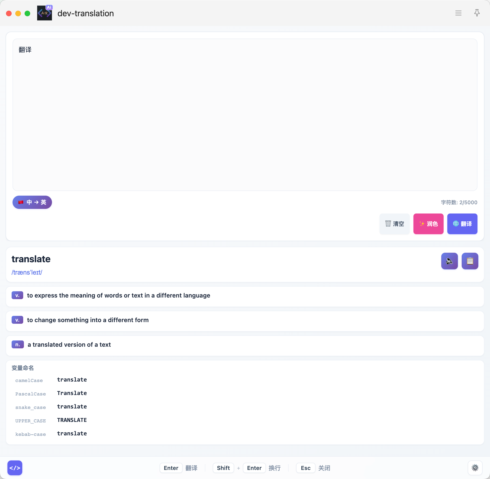

# Dev Translation - 开发者翻译

专为开发者设计的 uTools 智能翻译插件，提供中英文互译、文本润色、变量命名等实用功能。



## 核心特性

### 智能翻译

- 自动检测输入语言，智能切换翻译方向
- 支持 **5 种翻译引擎**：uTools AI（结构化翻译，含音标、释义、例句）、第三方 AI（OpenAI 兼容 API）、Google 翻译（免费快速）、DeepL（官方 API）、DeepLX（自部署）
- **故障转移机制**：主引擎失败或超时时按配置顺序自动切换至备用引擎；每个引擎默认 5 秒内未取得译文即视为失败（可在设置中改为 1–60 秒）；未配置或翻译服务未加载的引擎会跳过而不计入失败率
- 提供美式 IPA 音标、英文释义、实用例句

### 变量命名助手

翻译单词或短语时，自动生成 5 种变量命名格式：

- **PascalCase**、**camelCase**、**snake_case**、**UPPER_CASE**、**kebab-case**
- 点击即复制，显示具体复制内容

### 文本润色

将技术文本改写为易于理解但保留适当专业性的表达，支持采纳或拒绝润色结果。

### 配置面板

全屏设置页面，支持：
- 语言检测策略切换（正则算法 / AI 模型）
- 多引擎管理：配置 5 种翻译引擎（uTools AI / 第三方 AI / Google / DeepL / DeepLX），自定义故障转移顺序与引擎响应超时
- 第三方 AI 引擎配置（endpoint、API Key、模型名、系统提示词），可远程拉取模型列表
- DeepL / DeepLX 引擎配置（官方 API Key 或自部署服务器地址 + 令牌）
- 翻译日志与引擎统计（成功/失败/跳过；日志仅保留类别与状态码等最少元数据）
- 一键测试引擎配置：真实调用选中引擎验证可用性，即时反馈成功/失败原因
- 按引擎分组管理输出设置（音标、释义、例句、变量命名、语境说明）
- 实时生效、自动持久化

## 使用方法

### 触发插件

- **关键词触发**：在 uTools 中输入 `翻译`、`translate` 或 `fanyi`
- **文本选择触发**：选中文本后右键选择"翻译"

### 快捷键

| 快捷键 | 功能 |
|--------|------|
| `Enter` | 执行翻译 |
| `Shift + Enter` | 输入换行 |
| `Esc` | 关闭插件 |

### 快捷操作

- 左下角 `</>` 按钮：切换变量命名模式
- 左下角引擎按钮：快速切换主翻译引擎（循环 uTools AI / 自定义 / Google / DeepL / DeepLX）
- 右下角 `⚙️` 按钮：打开设置页面
- 底部 `⭐ 好用就 Star` 链接：跳转 GitHub 仓库
- 左键语言徽章：手动切换翻译方向
- 右键语言徽章：重新自动检测

## 技术栈

- **前端框架**：Vue 3 (Composition API)
- **构建工具**：Vite 6.x
- **包管理器**：pnpm
- **运行环境**：uTools 插件环境

## 系统要求

- [uTools](https://u.tools/) 应用
- uTools AI 服务（使用 AI 翻译功能时需要）
- 网络连接

## 开发

```bash
# 安装依赖
pnpm install

# 开发模式
pnpm dev

# 构建
pnpm build
```

## 版本历史

详见 [CHANGELOG.md](./CHANGELOG.md)。
